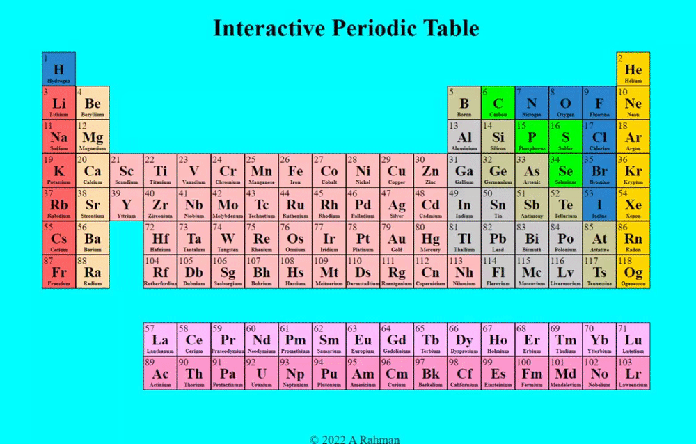

# Interactive Periodic Table

An interactive periodic table that displays all 118 elements and their associated data

**Link to project:** [https://arahm730.github.io/periodic-table](https://arahm730.github.io/periodic-table/)

## How It's Made:

**Tech used:** HTML, CSS, JavaScript, React.js

 
 
## How to run the application:

### `npm start`

Runs the app in the development mode.\
Open [http://localhost:3000](http://localhost:3000) to view it in your browser.

The page will reload when you make changes.
